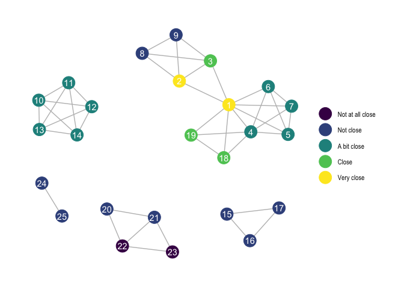

<!-- README.md is generated from README.Rmd. Please edit that file -->

# FertNet

<!-- badges: start -->

[](https://CRAN.R-project.org/package=FertNet)
[](https://github.com/gertstulp/FertNet/actions/workflows/R-CMD-check.yaml)
<!-- badges: end -->

The goal of `FertNet` is very specific, namely to process and correct
the **Social Networks and Fertility Data**, with a special focus on the
network data. The data was collected through the LISS (Longitudinal
Internet studies for the Social Sciences) panel, and can be downloaded
from <https://www.dataarchive.lissdata.nl/study_units/view/1377>. The
data is freely available, but requires registration.

The aim of the **Social Networks and Fertility Data** was to collect
personal network data from a representative sample of Dutch women. 758
women each named 25 individuals from their network (so-called alters),
reported on several characteristics about these individuals (alter
attributes), and also listed the relationships between those 25
individuals (alter-alter-ties). This package helps to deal with this
network data by producing dataframes with alter attributes and
dataframes with edgelists (alter-alter-ties) and storing them in
list-columns. This facilitates later analyses and visualisation of these
networks, particularly when these datasets are transformed into
`tidygraph`-objects. Additionally, this package corrects some of the
reporting errors of the respondents, and provides sensible variables
names and English labels.

For this package it is important that you download the SPSS-version of
the data, named `wj18a_EN_1.0p.sav` from
[HERE](https://www.dataarchive.lissdata.nl/study_units/view/1377).

## Installation

You can install FertNet like so:

``` r
install.packages("FertNet")
```

You can install the development version of FertNet like so:

``` r
if (!require("remotes")) install.packages("remotes")
remotes::install_github("gertstulp/FertNet")
```

## Example

The main function of the FertNet package is `produce_data`. *\[be sure
to have `wj18a_EN_1.0p.sav` downloaded and in your working directory\]*

``` r
library(FertNet)
#> When you use this package in your work, please cite:
#> Stulp, G. (2023). Describing the Dutch Social Networks and Fertility Study and how to process it. Demographic Research 49(19), 493-512. https://www.demographic-research.org/articles/volume/49/19
data <- produce_data()
```

`produce_data()` is a wrapper around several functions, each of which
gives some insights into what happens. The below code results in the
exact same as `produce_data()`:

``` r
data <- read_data() |> 
  translate() |>
  change_column_types() |>
  fix_errors() |>
  create_relation_labels() |>
  create_nw() 
```

### Getting more out of the data

The package also allows you to:

1)  Create a new variable to the dataset that is a list-column with
    `tidygraph`-objects. For this, the `tidygraph` package needs to be
    installed.

2)  Add background variables of the respondents. For this to work, you
    need to download the SPSS-version of the background data from
    February 2018, named `avars_201802_EN_1.0p.sav` from
    [HERE](https://www.dataarchive.lissdata.nl/study_units/view/322).
    The data is freely available, but requires registration.

The below code is therefore probably what most researchers are after.

``` r
data <- produce_data(tidygraph_col = TRUE,
                     background_vars = TRUE)
```

Let’s produce a visualisation of a network for one of the respondents.
This requires the package `ggraph`.

``` r
if (!require("ggraph")) install.packages("ggraph")
library(ggraph)
ggraph(data$tidygraph[[13]], layout = "kk") +
  geom_edge_link(colour = "grey") +
  geom_node_point(aes(colour = closeness_a), size = 7) +
  geom_node_text(aes(label = names_a), colour = "white") +
  labs(colour = NULL) +
  theme_graph()
```



The `produce_data` function comes with one additional argument that
allows you to keep the variables on the time it took respondents to
answer each question. This information is probably less relevant to most
researchers, which is why it defaults to being excluded.

``` r
data <- produce_data(remove_timing_vars = TRUE)
```

### Some further details on what the package does

`FertNet` corrects data entry errors or errors that respondents
themselves mentioned in the comments. For more information, please see
the file `fix_errors.R` and Stulp (2020) \[reference below\]. This
package also categorises the outcomes on the 25 variables that describe
the respondent’s relation to the 25 individuals in the network (e.g.,
partner, parent, sibling, known from high school). This also includes
processing the ‘qualitative’ data recorded via open text boxes (which
occurred 1,159 times). See Buijs and Stulp (2022) \[reference below\]
for further details.

## Codebook

The codebook of the dataset resulting from using this package can be
found here:

Stulp, G. (2023). Materials for Describing the Dutch Social Networks and
Fertility Study and How to Process it.
<https://doi.org/10.34894/4GG6SH>, DataverseNL, V1

## Citation

When using this package, please cite:

Stulp, G. (2023). Describing the Dutch Social Networks and Fertility
Study and how to process it. Demographic Research 49(19), 493-512.
doi.org/10.4054/DemRes.2023.49.19.

## Other useful resources on the study

- Stulp, G. (2020). Methods and Materials of the Social networks and
  fertility survey (Sociale relaties en kinderkeuzes),
  <https://doi.org/10.34894/EZCDOA>, DataverseNL, V3

- Stulp, G. (2021). Collecting large personal networks in a
  representative sample of Dutch women. Social Networks ,64, 63–71.
  <https://doi.org/10.1016/j.socnet.2020.07.012>.

- Buijs, VL, & Stulp, G. (2022). Friends, family, and family friends:
  Predicting friendships of Dutch women. Social Networks, 70, 25–35.
  <https://doi.org/10.1016/j.socnet.2021.10.008>.

- Stadel, M & Stulp, G. (2022). Balancing bias and burden in personal
  network studies. Social Networks, 70, 16–24.
  <https://doi.org/10.1016/j.socnet.2021.10.007>.

- Stulp, G & Barrett, L. (2021). Do data from large personal networks
  support cultural evolutionary ideas about kin and fertility? Social
  Sciences 10, 177. <https://doi.org/10.3390/socsci10050177>.

- Stulp, G., Top, L., Xu, X., & Sivak, E. (2023). A data-driven approach
  shows that individuals’ characteristics are more important than their
  networks in predicting fertility preferences. Royal Society Open
  Science 10(12), 230988. doi.org/10.1098/rsos.230988.
